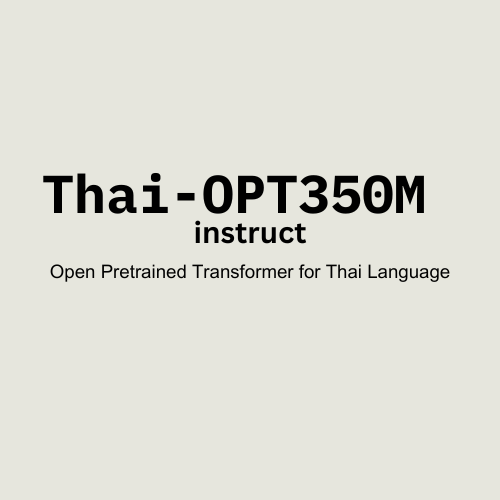

# thai-opt350m-instruct
 a generative language model for thai language based on opt350m

**Thai-OPT350M-Instruct** is a fine-tuned pretrained transformer for **thai language** based on facebook/opt-350m.

Dataset for thai-opt350m-instruct
- yadapruk/thai-instructions-rallio

## Base Model
- Facebook Open Pretrained Transformer

## Languages 
- mainly support Thai Language
- a few English, Chinese, Arabic

## Training
- epochs - 12
- training loss - 0.809200

# Model Page

[https://huggingface.co/jojo-ai-mst/thai-opt350m-instruct](https://huggingface.co/jojo-ai-mst/thai-opt350m-instruct)

## Prompt Format

```
User: อะไรคือวิธีที่ดีที่สุดในการทําความสะอาดพรม Assistant:
```

# How to use

```python
model = AutoModelForCausalLM.from_pretrained("jojo-ai-mst/thai-opt350m-instruct")
tokenizer = AutoTokenizer.from_pretrained("jojo-ai-mst/thai-opt350m-instruct")

def generate_text(prompt, max_length=200, temperature=0.8, top_k=50):
    input_ids = tokenizer.encode(prompt, return_tensors="pt").cuda() # remove .cuda() if only cpu
    output = model.generate(
        input_ids,
        max_length=max_length,
        temperature=temperature,
        top_k=top_k,
        pad_token_id=tokenizer.eos_token_id,
        do_sample=True
    )
    for result in output:
      generated_text = tokenizer.decode(result, skip_special_tokens=True)
      print(generated_text)

generate_text("User: อะไรคือวิธีที่ดีที่สุดในการทําความสะอาดพรม Assistant:")
```

# Date of Release 

22/03/2024

# License

MIT

# Author

[Min Si Thu](https://www.linkedin.com/in/min-si-thu/)

# Notes

This ai model is a movement of [MyanmarGPT-Movement](https://github.com/MyanmarGPT-Movement).
